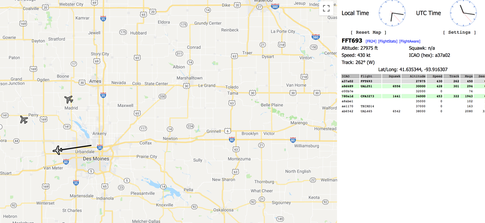
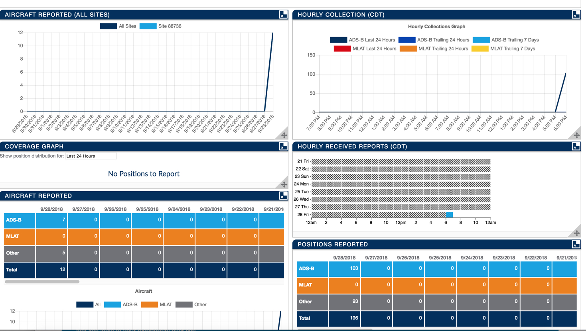

**Session Objective:**  This is a simple little project to demonstrate docker on a Raspery Pi and provide you with an introduction to the simplicity and power of containers.

I will attempt to drop some basic knowledge about Docker and Containers throughout this example. Pay attention!!!!

---

## Overview

**Here are the links to other blogs and github pages for reference**
Here are some good links to reference. We are using some of the information in these links to build our docker images.

- https://blog.alexellis.io/track-flights-with-rpi/
- https://github.com/alexellis/eyes-in-the-sky/blob/master/flightaware/Dockerfile
- https://github.com/LoungeFlyZ/eyes-in-the-sky

- https://flightaware.com/adsb/piaware/install
- https://github.com/thibmaek/awesome-raspberry-pi#projects

**What is ADS-B**
Modern aircraft have automatic transponders on board which gather info from navigational instruments and broadcast it to the surrounding area using ADS-B. It's not encrypted so anyone can pick it up whether you're a flight controller, another plane or even a Raspberry Pi owner.

Automatic dependent surveillance – broadcast (ADS–B) is a surveillance technology in which an aircraft determines its position via satellite navigation and periodically broadcasts it, enabling it to be tracked -- Wikipedia

**What You Need**

Here is what you need:
- RasperyPi Device
    - I would recommend using a Raspberry Pi 2 or 3 because it has more memory available and is better suited to multi-tasking.
- MicroSD card
- NooElec ADSB Reciever
    - NooElec NESDR Mini 2+ 0.5PPM TCXO RTL-SDR & ADS-B USB Receiver Set w/ Antenna, Suction Mount, Female SMA Adapter & Remote Control, RTL2832U & R820T2 Tuner
- A desire to learn
- A little bit of Linux skill (Just a little)

# Setup & Configuration of the Raspberry Pi


## Download and install OS on SSD Card
- Download the OS ZIP for Rasparian Stretch with Desktop (I use desktop). I won't go into details here because it's fairly simple. I use a macbook pro, so I have a SD Slot on my machine. I simply download the Raspbian image and use Etcher to load the image on my SD card. Once that's done all you need to do is boot the Pi up and finsih the inital setup.
    - https://www.raspberrypi.org/downloads/raspbian/
- Download Etcher to burn the image to the SSD Card.
    - https://etcher.io/
- Boot your Raspberry Pi and configure the OS
	- Setup WIFI
    - enalbe SSH
    - **CHANGE THE PASSWORD FOR USER pi**

## Setup Dynamic DNS

I use duckdns.org to setup my dynamic IP address on the Pi. I do this because I am often using my phone's hotspot for internet connectivity and the ip address changes every time my Pi boots. You will need to know the IP address of your pi to ssh into the pi from a terminal window.

**note**: _I have found that must also have my laptop connected to my phone's hotspot in order to ssh into my pi. That may not be the case for for everyone. Just to be safe, I would connect your laptop to the same hotspot as your pi when you want to ssh into the pi_

Go to this site for the instructions to setup and configuration dynamic dns on your pi.
https://www.duckdns.org/
- sign in to the site.
    - You can use Twitter, Facebook, Google, or Reddit to sign in. (Quick and easy!!)
- create a dynamic domain name
- Configure your Pi to send the IP address to the server, so the domain name gets updated with the IP address at boot.
	- Follow these instructions here:
        - http://www.duckdns.org/install.jsp

**Note**: _I had to make one minor change to the duck.sh script because it wasn't picking up the right ip address. You will need to add your own token and your domain name of course_

```
ip=($( ifconfig | grep "inet " | grep -v 127.0.0.1 | cut -c 14-25))

echo ${ip}

echo url="https://www.duckdns.org/update?domains=<your domain>&token=<your token>&ip="${ip} | curl -k -o ~/d
uckdns/duck.log -K -
```

## Setup SSH on the Pi**

Follow these instructions to enable ssh on the pi. You then do not need to have a monitor hooked up to connect.
https://www.raspberrypi.org/documentation/remote-access/ssh

**Reboot your Pi**
Now you should be able to ssh into your pi using your terminal window on your laptop.

```
ssh pi@<yourdomainname>.duckdns.org
```

## Install Docker on the Pi
We need to install Docker on the Pi, so that we can pull some images down from docker hub and deploy them as running continaers on the pi.

YEP.. It installs with one command.

```
curl -sSL https://get.docker.com | sh
```

**Learn Some Docker Stuff** https://training.play-with-docker.com/s

Once this completes, we can test it by runnig the docker help command

```
docker --help
```

If successful, that should show you the help menu for the docker command.

We need to give the pi user is lacking permissions to access the unix socket to communicate with the engine. If we do not do this, we will see an error when you try to run a docker image.

```
sudo usermod -a -G docker pi
```
**Reboot**
```
sudo reboot now
```
We should be all good to go now.. Let's try running a very simple Docker image. Run this command to pull down a docker image and run it.
```
docker run hello-world
```
If successful, you should see something like this.

```
Unable to find image 'hello-world:latest' locally
latest: Pulling from library/hello-world
61e750ce94d2: Pull complete
Digest: sha256:0add3ace90ecb4adbf7777e9aacf18357296e799f81cabc9fde470971e499788
Status: Downloaded newer image for hello-world:latest

Hello from Docker!
This message shows that your installation appears to be working correctly.

To generate this message, Docker took the following steps:
 1. The Docker client contacted the Docker daemon.
 2. The Docker daemon pulled the "hello-world" image from the Docker Hub.
    (arm32v7)
 3. The Docker daemon created a new container from that image which runs the
    executable that produces the output you are currently reading.
 4. The Docker daemon streamed that output to the Docker client, which sent it
    to your terminal.

To try something more ambitious, you can run an Ubuntu container with:
 $ docker run -it ubuntu bash

Share images, automate workflows, and more with a free Docker ID:
 https://hub.docker.com/

For more examples and ideas, visit:
 https://docs.docker.com/get-started/
```

### Running Docker on a Raspberry Pi - Things to know!!

Here we run Docker on a Raspberry Pi. So the CPU architecture here is ARM rather than x86/x64 by Intel or AMD. Thus, Docker-based apps you use have to be packaged specifically for ARM architecture! Docker-based apps packaged for x86/x64 will not work and will result in an error such as:

```
FATA[0003] Error response from daemon: Cannot start container 0f0fa3f8e510e53908e6a459e817d600b9649e621e7dede974d6a65761ad39e5: exec format error
```


## Clone the follow Github repository

We will now pull down the github repository with the required files to build our image.

Navigate your terminal window to your home directory and execute the git clone command.

If you just type cd and enter that will put you in your home directory. We do this because the next command will create a directory and you need to have authority to create directories. Also, you need to know where it is for later.

```
cd
```
Now let's clone that directory.
```
git clone https://github.com/alexellis/eyes-in-the-sky
```
## Blacklist the USB TV stick
In order for the dump1090 software to access the USB TV stick we have to create a blacklist entry for its kernel module.

- Edit the /etc/modprobe.d/blacklist.conf
    - I use nano as my editor. The Pi should have this editor already installed if you followed my instructions to setup the pi.
```
sudo nano /etc/modprobe.d/blacklist.conf
```

This will bring you to the nano editor and source the blacklist.conf file. Add the following line to the bottom of the file and save your changes. You may find that this file is actually empty and that's ok. Just add the line below and save it.

```
blacklist dvb_usb_rtl28xxu
```
**Note**: To save your changes using nano [ctl+x], select y, and hit enter.

## REBOOT YOUR PI
```
sudo reboot now
```

It will take a few minutes to reboot your Pi. Once it's back on-line you can ssh back into the pi.

```
ssh pi@<yourdomain>.duckdns.org
```

## Build the docker image.
Change directory to this folder. You should be at your home directory as soon as you log in.
```
cd eyes-in-the-sky/
```

Now run the build (This is all one command)
```
docker build -t alexellis2/dump1090:malcolmrobb . -f Dockerfile.malcolmrobb
```
-t is how we specify the image name for use later
-f allows us to pick a Dockerfile with a custom name, I've provided one for mutability's fork too.

There is already an image in the docker hub that we could have used, but we wanted to show you how you can build your own image using the docker file. Take a look at the dockerfile to see all the steps necessary to build this image. It's located in your home/eyes-in-the-sky folder.

We could have just pulled the image down from docker hub using the following command, but that wouldn't be as much fun!. You don't need to run this command, I just wanted to show you what the pull command looks like.

```
docker pull alexellis2/dump1090:malcolmrobb
```
## Test the dump1090 Docker image
```
docker rm -f 1090 # remove any old container

docker run --privileged -p 8080:8080 -p 30005:30005 -p 30003:30003 --privileged --name 1090 -d alexellis2/dump1090:malcolmrobb
```

The docker run command is responsible for starting our code.

- the -p flag is used to tell Docker which ports to expose from the container. You can run two copies of the dump1090 code by changing the port number and name on your Docker container.

- the -d flag puts the container into the background as a daemon, so if you want to see the console output just type in docker logs --tail 20 -f 1090

**View the web page produced by this container** : http://<PI IP Address>:8080/

**Note** _You can use your domainname.duckdns.org:8080 instead of the ip address. Both should work!_

- You will need to move the map to your location to see aircraft in your area. My range is about 100 Miles.



## Removing Containers 

**Note**: If you do this, you will need to issue the full docker run command (above) to restart the container from the image if you issue the _docker rm_ command.

**Remember** containers are a runable instance of the image. You still have the image loaded even if you remove the container. 


```
docker rm -f 1090
```

## Stoping / Starting Containers

**Note**: Stoping the container doesn't remove it. It's still there and can be started again anytime. I sometimes stop containers to free up some processing power on the machine, so I can run other containers. 

```
docker stop 1090
```

To start the container up again you can use this command.

**Note**: The start command will still uses the parameters you specified in the run coommand (see below), but you don't have to specify them again to start it up. 
> --privileged -p 8080:8080 -p 30005:30005 -p 30003:30003 --privileged --name 1090 -d alexellis2/dump1090:malcolmrobb
> }

```
docker start 1090
```

## Let's look at Docker stuff

You can issue the docker command to list all images in your local repository.
```
docker images
```

Take a look at the output of this command. You should see multiple images if you followed all the instructions. This is because we loaded the hello-world as well as the dump1090 image. These are images, not the runable containers.
```
REPOSITORY            TAG                 IMAGE ID            CREATED             SIZE
hello-world           latest              b7012647d53a        2 weeks ago         1.64kB
alexellis2/dump1090   malcolmrobb         a50c1e10a8ec        14 months ago       298MB
```

Take a look at the docker processes (containers) on this machine.
```
docker ps
```
These are the containers running at this very moment on the docker engine. If we stop the containers they will not show up here.

If you want to see ALL the docker containers (even the ones we don't have running) try this command.
```
docker ps -a
```
- the -a command will list ALL containers.
- You will probably notice a few more containers in this list, but some of them have an exit status.

## Installing FlightAware
There are several flight-tracking websites available, but lets start  out with this one. Their software connects to your dump1090 code and streams your data to their online servers where you can collate statistics and compare your range and statistics with others through leaderboards.

You will need an account on the FlightAware.com website.
- Now sign up on the FlightAware.com website for a username and password.

**Note**: Don't forget the dot at the end of the command.
```
cd eyes-in-the-sky/flightaware
docker build -t alexellis2/flightaware:3.5.0 .
```

Edit the /eyes-in-the-sky/flightaware/piaware.conf file replacing the following fields.
- receiver-host  
    - (Use the Pi's IP address or the domainname.duckdns.org address)
    - Just note that if you use the ip address it may change later.
- flightaware -user
- flightaware -password
```
sudo nano piaware.conf
```
FlightAware has a smart feature to track your Raspberry Pi by MAC address - fortunately Docker allows us to spoof the MAC address so we can run multiple copies of the software. If you do this just change the MAC so it's unique for each copy of the software.

Let's now run the image and watch the logs:

**Note**: Run this docker command from the /eyes-in-the-sky/flightaware/ directory so that it can find the piaware.conf file.

```
docker run --mac-address 02:42:ac:11:44:01 -v `pwd`/piaware.conf:/etc/piaware.conf --name piaware_1 -d alexellis2/piaware:3.5.0
```

After a few moments you should see your pi on the flightaware website.
https://flightaware.com/adsb/stats/user/**YOUR_USERNAME**




---
