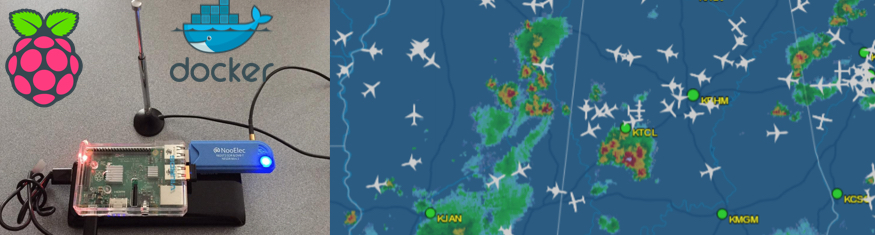

**Session Objective:**  This is a simple little project to demonstrate docker on a RasperyPi and provide you with an introduction to the simplicity and power of containers. 

---

## Overview

**Here are the links to other blogs and github pages for reference**
https://blog.alexellis.io/track-flights-with-rpi/
https://github.com/alexellis/eyes-in-the-sky/blob/master/flightaware/Dockerfile
https://github.com/LoungeFlyZ/eyes-in-the-sky


**What You Need**

Here is what you need:
- RasperyPi Device
- MicroSD card
- NooElec ADSB Reciever
- A desire to learn
- A little bit of Linux skill (Just a little)

# Setup & Configuration of the Raspberry Pi


**Download and install OS on SSD Card**
- Download the OS ZIP for Rasparian Stretch with Desktop (I use desktop) 
    - https://www.raspberrypi.org/downloads/raspbian/
- Download Etcher to burn the image to the SSD Card. 
    - https://etcher.io/
- Boot your Raspberry Pi and configure the OS
	- Setup WIFI

##Setup Dynamic DNS

I use duckdns.org to setup my dynamic IP address on the Pi. I do this because I am using my phone's hotspot and the ip address changes every time my Pi boots. 

https://www.duckdns.org/
- sign in to the site. 
- create a dynamic domain name
- Configure your Pi to send the IP address to the server, so the domain name gets updated with the IP address at boot. 
	- Follow these instructions
        - http://www.duckdns.org/install.jsp

**Note**: _I had to make one minor change to the duck.sh script._

```
    ip=($( ifconfig | grep "inet " | grep -v 127.0.0.1 | cut -c 14-25))

    echo ${ip}

    echo url="https://www.duckdns.org/update?domains=<your domain>&token=<your token>&ip="${ip} | curl -k -o ~/d
uckdns/duck.log -K -
```

##Setup SSH on the Pi** 

Follow these instructions to enable ssh on the pi. You then do not need to have a monitor hooked up to connect. 
https://www.raspberrypi.org/documentation/remote-access/ssh


---
